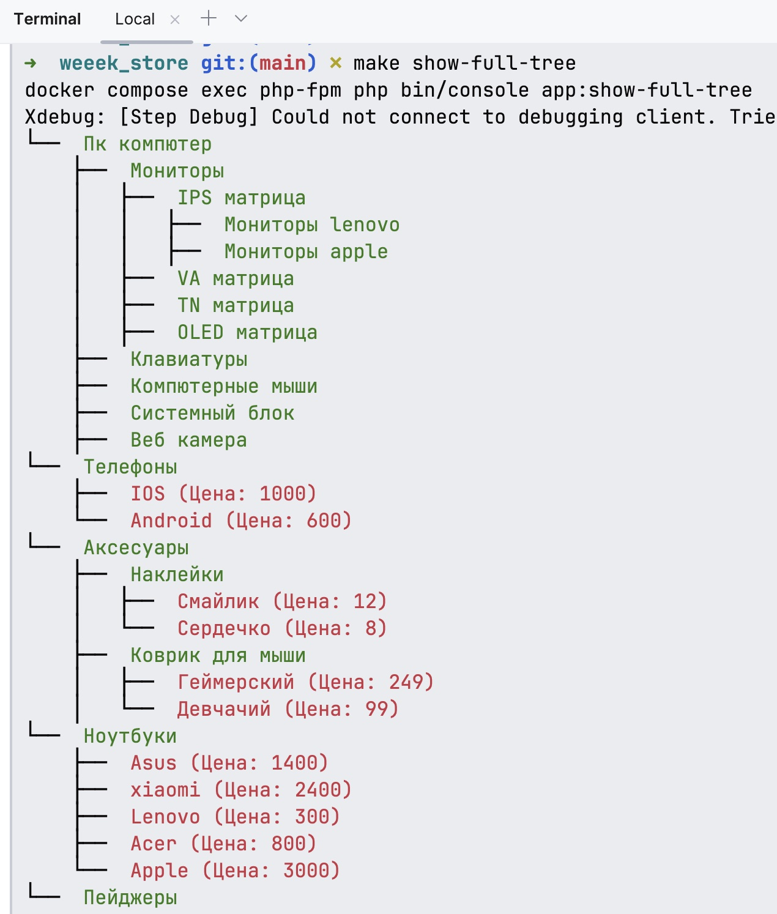

### В Makefile для удобства есть команды

Создание отчетов покупок
> make consume

Запуск обработки очереди (для создания отчетов)

---
> make order-report-json:

или 

> make order-report-csv:

---

#### Вывод дерева категорий с продуктами

>  make show-full-tree

Или
> php bin/console app:show-full-tree

Или

> docker compose exec php-fpm php bin/console app:show-full-tree

